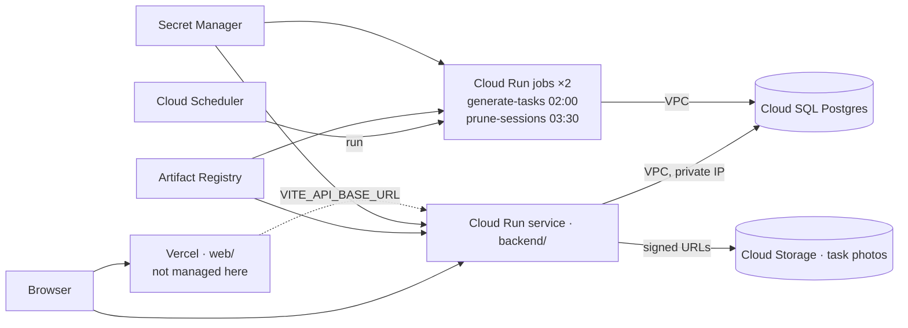

# infra/

```mermaid
flowchart LR
  B[Browser] --> V[Vercel · web/<br/>not managed here]
  B --> S[Cloud Run service · backend/]
  S -- VPC, private IP --> DB[(Cloud SQL Postgres)]
  J[Cloud Run jobs ×2<br/>generate-tasks 02:00<br/>prune-sessions 03:30] -- VPC --> DB
  CS[Cloud Scheduler] -- run --> J
  AR[Artifact Registry] --> S
  AR --> J
  SM[Secret Manager] --> S
  SM --> J
  S -- signed URLs --> GCS[(Cloud Storage · task photos)]
  V -. VITE_API_BASE_URL .-> S
```
